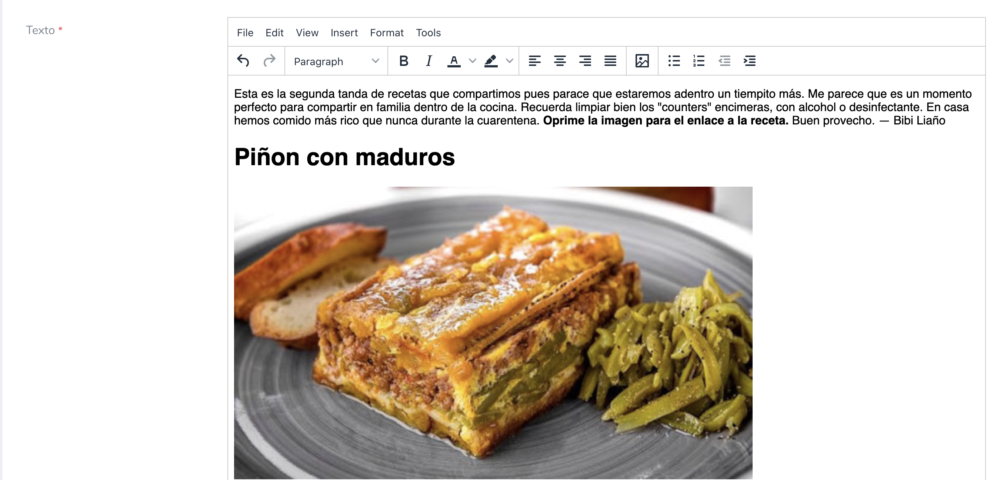

# Laravel Nova TinyMCE editor

[](https://packagist.org/packages/marshmallow/nova-tinymce)
[](https://packagist.org/packages/marshmallow/nova-tinymce)

This Nova package allows you to use the [TinyMCE editor](https://tiny.cloud) for text areas. You can fully customize the editor options, define reusable styling, add custom buttons and variables, and optionally upload images straight into the editor.



## Requirements

- PHP `^8.0`
- Laravel Nova `^4.0` or `^5.0`

## Installation

Install the package via Composer:

```bash
composer require marshmallow/nova-tinymce
```

Publish the TinyMCE JavaScript, CSS, and skin assets to your `public` directory:

```bash
php artisan vendor:publish --provider="Marshmallow\Nova\TinyMCE\FieldServiceProvider" --tag="resources"
```

This publishes the assets to `public/vendor/tinymce`. Republish them after every package update so the editor assets stay in sync.

### Publish the config file (optional)

Publish the config to override any of the default TinyMCE settings:

```bash
php artisan vendor:publish --provider="Marshmallow\Nova\TinyMCE\FieldServiceProvider" --tag="config"
```

## Usage

Add the `TinyMCE` field to the `fields` array of your Nova resource. The field is hidden on the index view by default.

```php
use Marshmallow\Nova\TinyMCE\TinyMCE;

public function fields(Request $request)
{
    return [
        ID::make()->sortable(),
        TinyMCE::make(__('Content'), 'content'),
    ];
}
```

### Set the height

The default height is defined in the `nova-tinymce.php` config file. Override it per field with the `height()` method:

```php
TinyMCE::make('body')->height(300),
```

### Add custom HTML (buttons)

Insert buttons or custom HTML with a single click using the `buttons()` method. The array key is the button label, the value is the HTML that gets inserted:

```php
TinyMCE::make('body')->buttons([
    'Name button' => 'value of HTML',
    'Name button2' => '<p>More HTML</p>',
]),
```

### Add variables

Insert variables with a single click using the `variables()` method:

```php
TinyMCE::make('body')->variables([
    'name_var' => 'value_var',
]),
```

### Set the toolbar

Override the toolbar string for a single field with the `toolbar()` method:

```php
TinyMCE::make('body')->toolbar('undo redo | bold italic | link'),
```

### Set the plugins

Override the active TinyMCE plugins for a single field with the `plugins()` method:

```php
TinyMCE::make('body')->plugins(['lists', 'link', 'image', 'table']),
```

### Pass any TinyMCE option

Pass any option supported by the TinyMCE JavaScript SDK through the `options()` method. The given options are merged on top of the defaults:

```php
TinyMCE::make('body')->options([
    'height' => '980',
]),
```

See the full list of options in the [TinyMCE configuration docs](https://www.tiny.cloud/docs/configure/).

### Add styling options per field

Add one or more entries to the field's style format ("Content type") selector at runtime with `addStyle()` and `addStyles()`:

```php
TinyMCE::make('body')->addStyle([
    'title' => 'Lead Paragraph',
    'block' => 'p',
    'classes' => 'lead',
]),

TinyMCE::make('body')->addStyles([
    ['title' => 'Lead Paragraph', 'block' => 'p', 'classes' => 'lead'],
    ['title' => 'Muted', 'inline' => 'span', 'classes' => 'text-muted'],
]),
```

### Add custom styling for all fields

To add styling options available on every TinyMCE field, publish the config and add entries to the `custom_items` array. These appear in the editor's "Content type" selector:

```php
'custom_items' => [
    // This adds a .lead class on the paragraph tag.
    [
        'title' => 'Lead Paragraph',
        'block' => 'p',
        'classes' => 'lead',
    ],
],
```

### File manager support

The package ships a `use_lfm` config option to integrate with a Laravel file manager (set `use_lfm` to `true` and configure `lfm_url`). After installing your file manager, run the bundled command to drop in the package's file manager view override:

```bash
php artisan nova-tinymce:support-lfm
```

## Configuration

The published `config/nova-tinymce.php` file exposes the defaults that are applied to every field. The most common keys:

| Key | Default | Description |
| --- | --- | --- |
| `custom_items` | one `Lead Paragraph` entry | Styling items shown in the "Content type" selector for every field. |
| `license_key` | `'gpl'` | TinyMCE license key. Use `'gpl'` for the self-hosted GPL build. |
| `cloud_api_key` | `null` | TinyMCE Cloud API key, or `null` for self-hosted. |
| `height` | `350` | Default editor height in pixels. |
| `content_css` | oxide + `custom.css` | Stylesheet(s) loaded inside the editor content area. |
| `skin_url` | oxide skin path | Path to the editor UI skin. |
| `content_css_dark` | oxide-dark content css | Content stylesheet used in dark mode. |
| `skin_url_dark` | oxide-dark skin path | UI skin used in dark mode. |
| `plugins` | array of TinyMCE plugins | Plugins enabled on every field. |
| `menubar` | `'file edit view insert format tools table'` | The editor menu bar. |
| `toolbar` | toolbar string | The editor toolbar layout. |
| `relative_urls` | `false` | Whether URLs are converted to relative paths. |
| `use_lfm` | `false` | Enable Laravel file manager integration. |
| `lfm_url` | `'filemanager'` | URL of the file manager. |
| `use_dark` | `true` | Enable dark-mode skins. |
| `browser_spellcheck` | `false` | Use the browser's native spell checker. |
| `link_class_list` | preset button classes | Class options offered when inserting a link. |
| `table_class_list` | `Default` | Class options for tables. |
| `image_class_list` | `Default` | Class options for images. |
| `color_map` | preset palette | The editor color picker palette. |
| `formats` | `[]` | Custom TinyMCE `formats` definitions. |
| `extra_options` | `[]` | Any additional raw TinyMCE options merged into every field. |

See `config/nova-tinymce.php` for the complete list of available keys.

## Changelog

Please see [CHANGELOG](CHANGELOG.md) for more information on what has changed recently.

## Security

If you discover any security related issues, please email stef@marshmallow.dev instead of using the issue tracker.

## Credits

- [All Contributors](https://github.com/marshmallow-packages/nova-tinymce/contributors)

## License

The MIT License (MIT). Please see the [License File](LICENSE) for more information.
